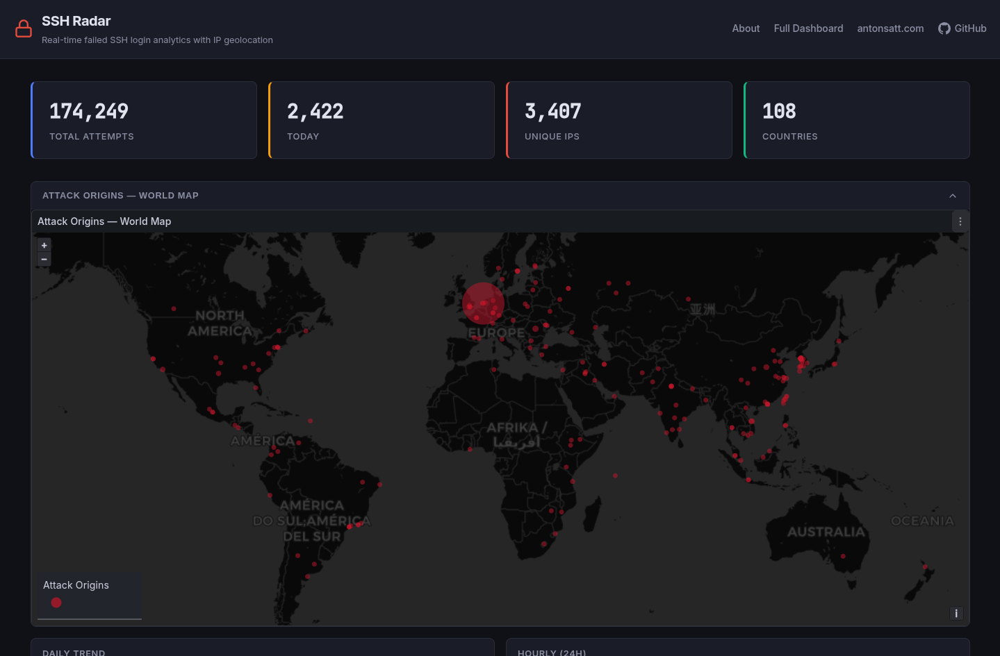
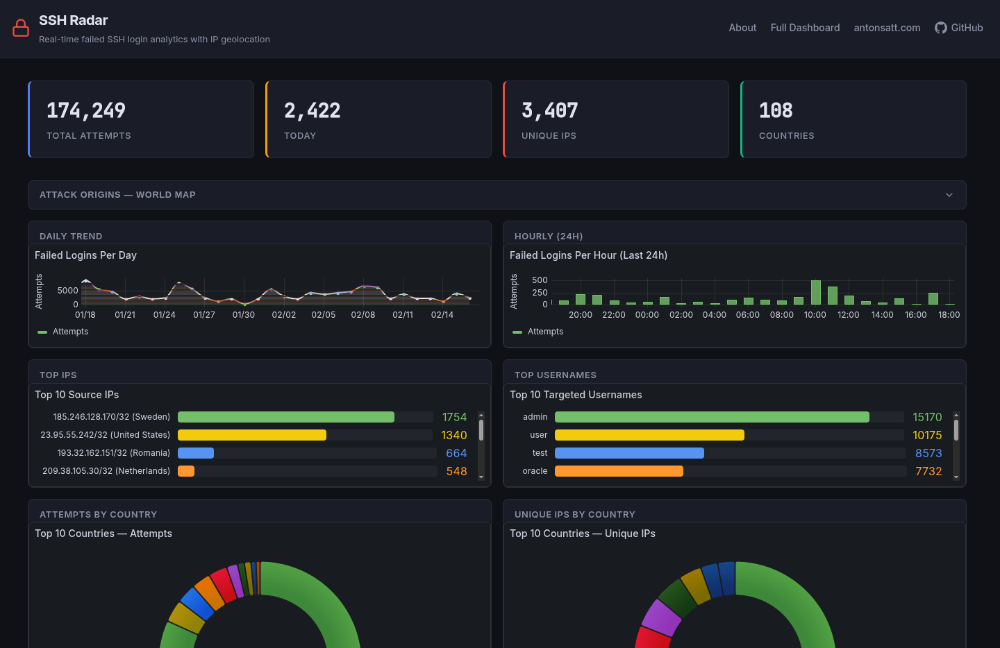

# SSH Radar

Real-time monitoring and visualization of failed SSH login attempts on a Linux server.

Parses `lastb` output, enriches IPs with geolocation data via MaxMind GeoLite2, stores everything in PostgreSQL, and presents it through a branded React frontend with embedded Grafana dashboards.

**Live instance:** [ssh-radar.antonsatt.com](https://ssh-radar.antonsatt.com)

<p align="center">
  
</p>

<p align="center">
  
</p>

## Architecture

```
                         ┌──────────────────────────────────┐
                         │        Oracle Cloud ARM          │
                         │      Ubuntu, 12GB RAM, 2 CPU     │
                         │                                  │
Internet ──► 443 ──►     │  ┌────────────────────────┐      │
                         │  │  nginx-proxy (Docker)  │      │
                         │  │  HTTPS + auto SSL certs │      │
                         │  └──────────┬─────────────┘      │
                         │             │                    │
                         │             ▼                    │
                         │  ┌──────────────────┐            │
                         │  │  React Frontend  │            │
                         │  │  (Nginx + SPA)   │            │
                         │  └────┬─────────────┘            │
                         │       │                          │
                         │    /grafana/                     │
                         │       │                          │
                         │       ▼                          │
                         │  ┌────────┐                      │
                         │  │Grafana │                      │
                         │  │ :3000  │                      │
                         │  └───┬────┘                      │
                         │      │                           │
                         │      ▼                           │
                         │  ┌───────────┐                   │
                         │  │PostgreSQL │◄── Ingestion      │
                         │  │  :5432    │    (host cron)    │
                         │  └───────────┘    lastb -F       │
                         │                   + GeoLite2     │
                         └──────────────────────────────────┘
```

- **Ingestion** runs on the host (not in Docker) because `lastb` needs root access to `/var/log/btmp`
- **PostgreSQL, Grafana, and the frontend** run as Docker containers
- **SSL/HTTPS** is handled automatically by an [nginx-proxy](https://github.com/nginx-proxy/nginx-proxy) + Let's Encrypt companion container (can be shared with other services on the same server)
- The **frontend container** serves the React SPA and reverse-proxies `/grafana/` to the Grafana container internally

## Features

- Parses `lastb -F` output with support for IPv4, IPv6, and edge cases
- Deduplicates login attempts using a unique constraint on `(username, source_ip, timestamp)`
- Offline IP geolocation via MaxMind GeoLite2-City database
- Grafana dashboard with 11 panels:
  - Stat cards (total attempts, today's attempts, unique IPs, unique countries)
  - Time series (daily and hourly trends)
  - World geomap with proportional markers
  - Top 10 countries (pie chart), top IPs, top usernames (bar gauges)
  - Detailed table of recent attempts
- React frontend with live stats and embedded Grafana panels
- Automated ingestion via cron (every 5 minutes)

## Prerequisites

- Docker and Docker Compose
- Python 3.8+ (on the host, for ingestion)
- An [nginx-proxy](https://github.com/nginx-proxy/nginx-proxy) + [letsencrypt-companion](https://github.com/nginx-proxy/acme-companion) setup on the Docker host (or any reverse proxy that routes based on `VIRTUAL_HOST`)
- A free [MaxMind GeoLite2 account](https://www.maxmind.com/en/geolite2/signup) (for IP geolocation)

## Setup

### 1. Clone and configure

```bash
git clone https://github.com/antonsatt/ssh-radar.git
cd ssh-radar
cp .env.example .env
```

Edit `.env` and fill in:
- `POSTGRES_PASSWORD` — a strong password for the database
- `DB_PASSWORD` — same password (used by the host ingestion script)
- `GF_SECURITY_ADMIN_PASSWORD` — Grafana admin password
- `MAXMIND_ACCOUNT_ID` — your MaxMind account ID (shown at https://www.maxmind.com/en/accounts/current)
- `MAXMIND_LICENSE_KEY` — your GeoLite2 license key
- `DOMAIN` — your domain (e.g. `ssh-radar.antonsatt.com`)
- `MAXMIND_DB_PATH` — adjust to match your install location (e.g. `/home/ubuntu/apps/ssh-radar/data/GeoLite2-City.mmdb`)

**Important:** If your password contains special characters (like `&`, `!`, `$`), ensure it does not conflict with shell interpretation. The ingestion script loads `.env` line-by-line to handle this safely.

### 2. Download the GeoLite2 database

```bash
bash src/update_geodb.sh
```

The script reads `MAXMIND_ACCOUNT_ID` and `MAXMIND_LICENSE_KEY` from your `.env` file automatically.

### 3. Install Python dependencies (on host)

```bash
python3 -m venv .venv
.venv/bin/pip install -r requirements.txt
```

### 4. Start the containers

The `docker-compose.yml` connects the frontend to an external Docker network so that an existing nginx-proxy can discover it. By default it expects a network called `generated_default` — update the `btcpay_network` section in `docker-compose.yml` to match your nginx-proxy's network:

```bash
# Find your nginx-proxy's network name:
docker inspect <your-nginx-proxy-container> --format '{{json .NetworkSettings.Networks}}' | python3 -m json.tool
```

Then update the network name in `docker-compose.yml` under `networks.btcpay_network.name` to match, and start the containers:

```bash
docker compose up -d
```

This starts PostgreSQL (with schema auto-initialized), Grafana (with provisioned datasource and dashboard), and the React frontend.

The frontend container exposes `VIRTUAL_HOST` and `LETSENCRYPT_HOST` environment variables. If you have an nginx-proxy + letsencrypt-companion running on the same Docker host, it will automatically:
- Route traffic for your domain to the frontend container
- Provision and renew SSL certificates via Let's Encrypt

### 5. Set up the cron job

```bash
sudo crontab -e
```

Add (adjust the path to your install location):

```
*/5 * * * * /home/ubuntu/apps/ssh-radar/scripts/run_ingest.sh >> /var/log/ssh-radar-ingest.log 2>&1
```

The `run_ingest.sh` script automatically loads `.env` from the project root, so no extra environment setup is needed.

### 6. Initial data load

Run the ingestion manually once to populate historical data:

```bash
sudo scripts/run_ingest.sh
```

If you have many existing login attempts, geolocation runs automatically for all new IPs. To backfill geolocation for previously ingested records:

```bash
sudo env $(grep -v '^#' .env | xargs) .venv/bin/python3 src/geolocate.py
```

## Project Structure

```
ssh-radar/
├── docker-compose.yml           # PostgreSQL + Grafana + Frontend
├── .env.example                 # Configuration template
├── requirements.txt             # Python dependencies
├── sql/
│   ├── 001_schema.sql           # Tables, indexes, constraints
│   └── 002_views.sql            # Views and materialized views
├── src/
│   ├── config.py                # DB connection, env vars, logging
│   ├── parser.py                # lastb -F output parser
│   ├── ingest.py                # Ingestion pipeline (CLI entry point)
│   ├── geolocate.py             # MaxMind GeoLite2 IP enrichment
│   └── update_geodb.sh          # Download/update GeoLite2 database
├── scripts/
│   └── run_ingest.sh            # Host cron runner script
├── grafana/
│   ├── provisioning/            # Auto-configured datasource + dashboard
│   └── dashboards/
│       └── ssh-radar.json       # Dashboard with 11 panels
├── frontend/
│   ├── src/                     # React + TypeScript + Vite
│   ├── Dockerfile               # Multi-stage build (Node → Nginx)
│   └── nginx.conf               # SPA fallback + Grafana reverse proxy
├── tests/
│   ├── test_parser.py           # 18 parser tests
│   ├── test_geolocate.py        # 17 geolocation tests (3 skip without DB)
│   ├── test_integration.py      # 10 integration tests (real PostgreSQL)
│   └── fixtures/
│       └── sample_lastb.txt     # Test data
└── data/                        # GeoLite2-City.mmdb (gitignored)
```

## Testing

```bash
.venv/bin/python3 -m pytest tests/ -v
```

45 tests total (42 pass, 3 skip). The 3 skipped tests require the GeoLite2 `.mmdb` database file in `data/`. Integration tests auto-start a temporary PostgreSQL Docker container.

## Tech Stack

| Component     | Technology                          |
|---------------|-------------------------------------|
| Language      | Python 3                            |
| Database      | PostgreSQL 16                       |
| Geolocation   | MaxMind GeoLite2 (offline)          |
| Visualization | Grafana OSS (anonymous viewer)      |
| Frontend      | React 18 + TypeScript + Vite        |
| Reverse Proxy | nginx-proxy + Let's Encrypt         |
| Deployment    | Docker Compose on Oracle Free Tier  |
| Scheduling    | Host cron (every 5 minutes)         |

## Security

- Grafana and PostgreSQL not exposed to the internet (internal Docker network only)
- Grafana anonymous access limited to Viewer role
- HTTPS enforced via Let's Encrypt (auto-provisioned)
- No secrets in the repository (`.env` is gitignored)
- Ingestion runs on the host with controlled DB access

## Author

**Anton Satterkvist** — [antonsatt.com](https://antonsatt.com)

Built as a portfolio project to demonstrate DevOps skills: Linux, Docker, PostgreSQL, Grafana, Python, CI/CD, and infrastructure security.

## License

MIT
